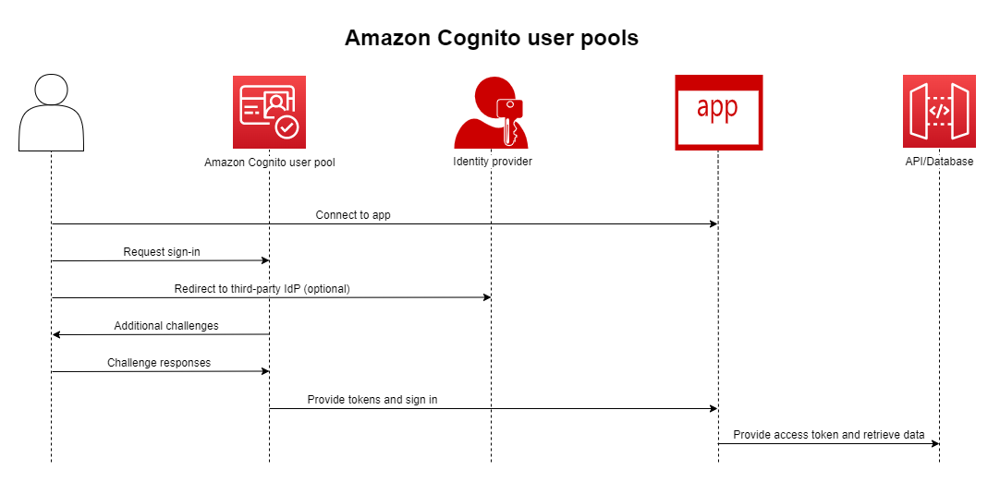

# What is Amazon Cognito?

* Amazon Cognito
  * provides | web and mobile apps
    * authentication, 
    * authorization,
    * user management
  * ways / your users can sign in
    * user name and password
    * TP
      * _Example:_ Facebook, Amazon, Google or Apple
  * main components
    * user pools
      * == user directories | Cognito / 
        * allows
          * your users can sign in | your web or mobile app
            * through Amazon Cognito, or 
            * federate through a TP IdP
          * ALL user pool's members have a directory profile / you can access -- through an -- SDK
      * provide
        + Sign\-up and sign\-in services
        + web UI
          + built\-in,
          + customizable
          + uses
            + sign in users
        + Social sign\-in 
          + with Facebook, Google, Amazon, Apple,
          + through SAML and OIDC identity providers
        + User directory management and user profiles\.
        + Security features 
          + _Example:_ MFA, checks for compromised credentials, account takeover protection, and phone and email verification
        + Customized workflows and user migration -- through -- AWS Lambda triggers
      * see 
        * [Getting started with user pools](getting-started-with-cognito-user-pools.md)
        * [Amazon Cognito user pools API reference](https://docs.aws.amazon.com/cognito-user-identity-pools/latest/APIReference/)
    * identity pools
      * allows
        * grant your users -- ,temporary AWS credentials, access to -- OTHER AWS services   
      * support
        * anonymous guest users,
        * following identity providers
          + Amazon Cognito user pools
          + Social sign-in with Facebook, Google, Amazon, Apple
          + OpenID Connect \(OIDC\) providers
          + SAML identity providers
          + Developer authenticated identities
      * if you want to save user profile information -> your identity pool -- needs to be integrated with a -- user pool
      * see
        * [Getting started with Amazon Cognito identity pools \(federated identities\)](getting-started-with-identity-pools.md) 
        * [Amazon Cognito identity pools API reference](https://docs.aws.amazon.com/cognitoidentity/latest/APIReference/)
  * compliant
    * with
      * SOC 1\-3,
      * PCI DSS,
      * ISO 27001,
      * HIPAA\-BAA eligible
    * see
      * [AWS services in scope](http://aws.amazon.com/compliance/services-in-scope/)
      * [Regional data considerations](security-cognito-regional-data-considerations.md)

* ways to use identity pools + user pools
  * separately
  * together
    * see [Common Amazon Cognito scenarios](cognito-scenarios.md) 
    * goal
      * authenticate your user
      * grant your user -- access to -- ANOTHER AWS service
      
    * steps 
      1. your app user
         1. signs in -- through a -- user pool
         2. AFTER a successful authentication -> receives user pool tokens
      2. your app -- exchanges, through an identity pool -- the user pool tokens for AWS credentials 
      3. your app user -- can, via those AWS credentials, to access -- OTHER AWS services

**Topics**
+ [Features of Amazon Cognito](#feature-overview)
+ [Getting started with Amazon Cognito](#getting-started-overview)
+ [Regional availability](#getting-started-regional-availability)
+ [Pricing for Amazon Cognito](#pricing-for-amazon-cognito)
+ [Using the Amazon Cognito console](cognito-console.md)
+ [Using this service with an AWS SDK](sdk-general-information-section.md)

## Getting started with Amazon Cognito

* see 
  * [Getting started with Amazon Cognito](cognito-getting-started.md)
  * [Amazon Cognito developer resources](https://aws.amazon.com/cognito/dev-resources/)

* requirements to use Amazon Cognito
  * AWS account
    * see [Using the Amazon Cognito console](cognito-console.md)

## Regional availability

* Amazon Cognito
  * available | 
    * MULTIPLE AWS Regions &
      * see [AWS regions and endpoints](https://docs.aws.amazon.com/general/latest/gr/rande.html##cognito_identity_region)
    * MULTIPLE AWS AZ / 
      * EACH region
      * -- from -- EACH other
        * physically isolated
        * united by network connections
          * private,
          * low\-latency,
          * high\-throughput,
          * highly redundant 
      * enable AWS -- to provide -- services (_Example:_ Amazon Cognito)
      * see [AWS global infrastructure](https://aws.amazon.com/about-aws/global-infrastructure/)

## Pricing for Amazon Cognito

* see [Amazon Cognito pricing](https://aws.amazon.com/cognito/pricing/)